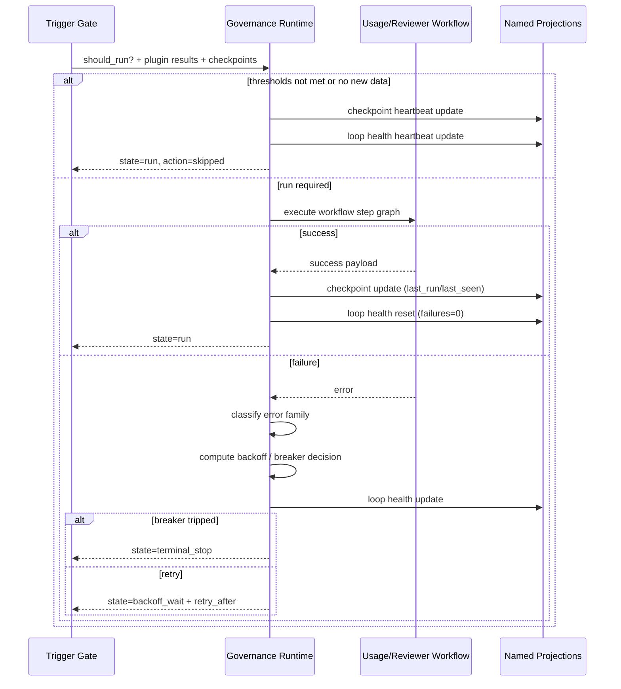

# Governance Runtime: Usage Analysis + Reviewer

This document covers runtime-native governance execution in ModelKeyGuard.

## Overview

ModelKeyGuard keeps two scanner workflows:

- `usage_analysis` (usage analytics collection/scanner)
- `usage_reviewer` (review note generation scanner)

They are separate public entrypoints but share one runtime subsystem:

- `modelkeyguard/governance_runtime.py`
- `WorkflowRuntime` (sync default)
- `AsyncWorkflowRuntime` (async opt-in)

## Loop safety model

Loop mode has explicit runtime states:

- `run`
- `backoff_wait`
- `terminal_stop`

Error families are normalized to:

- `quota_limit`
- `auth_denied`
- `upstream_transient`
- `runtime_internal`

Default production-safe behavior:

- exponential backoff: `30s -> 60s -> 120s -> 300s`, cap at `15m`
- breaker disabled by default
- if breaker is enabled and a terminal-policy family repeats past threshold, workflow transitions to `terminal_stop`

## Runtime and policy knobs

CLI flags on both scanner scripts:

- `--runtime-mode sync|async`
- `--loop`
- `--interval-seconds`
- `--max-iterations`
- `--scanner-backoff-initial-seconds`
- `--scanner-backoff-max-seconds`
- `--scanner-breaker-enabled`
- `--scanner-breaker-max-failures`
- `--scanner-error-family-policy-json`

Environment variables:

- `MODELKEYGUARD_SCANNER_BACKOFF_INITIAL_SECONDS`
- `MODELKEYGUARD_SCANNER_BACKOFF_MAX_SECONDS`
- `MODELKEYGUARD_SCANNER_BREAKER_ENABLED`
- `MODELKEYGUARD_SCANNER_BREAKER_MAX_FAILURES`
- `MODELKEYGUARD_SCANNER_ERROR_FAMILY_POLICY_JSON`

Policy shape (optional):

```json
{
  "scanner": {
    "backoff": {
      "initial_seconds": 30,
      "max_seconds": 900
    },
    "breaker": {
      "enabled": false,
      "max_consecutive_failures": 3
    },
    "retry": {
      "error_family_policy": {
        "quota_limit": "retry",
        "auth_denied": "retry",
        "upstream_transient": "retry",
        "runtime_internal": "retry"
      }
    }
  }
}
```

## Checkpoint and CDC semantics

Authority and serving model:

- graph nodes/edges/events are authoritative facts
- scanner checkpoints and loop health are rebuildable named projections
- scanner loops read graph/projections and write only checkpoint/health projections

Current projection namespaces:

- `modelkeyguard.usage.scanner.checkpoint`
- `modelkeyguard.governance.scanner.health`
- reviewer checkpoint remains `modelkeyguard.review.checkpoint`

Deterministic behavior:

- no-new-data windows are skipped without reprocessing
- skip cycles update heartbeat metadata
- run cycles update `last_run_ts` and `last_seen_request_id`

## Swimlane



## Backend guidance

- tutorial/local speed path: in-memory + `jsonl`
- serious production path: `postgres` or `kogwistar_postgres`

There is no silent fallback from serious backend modes to toy mode.
