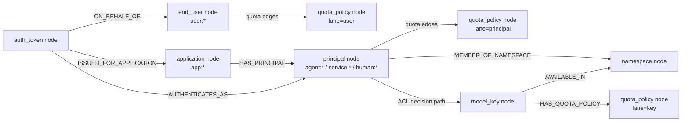
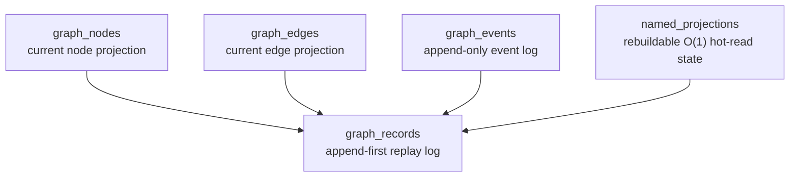

# ModelKeyGuard Schema and Kogwistar-Semantics Map

This document makes backend distinctions explicit:

- `MODELKEYGUARD_STORE=jsonl` is toy/tutorial mode.
- `MODELKEYGUARD_STORE=postgres` is the local serious backend implemented in this repo.
- `MODELKEYGUARD_STORE=kogwistar_postgres` is delegated serious mode using installed Kogwistar Postgres primitives.

## Integration truth table

| Capability | Current implementation in this repo | Import from Kogwistar? |
| --- | --- | --- |
| ACL decision graph | `kogwistar_acl_adapter.py` | Yes; required in `kogwistar_postgres` mode |
| Named projection primitive (`postgres`) | `PostgresGraphStateStore.get_named_projection/replace_named_projection/list_named_projections/clear_named_projection` | No (local implementation, Kogwistar-compatible semantics) |
| Named projection primitive (`kogwistar_postgres`) | `EnginePostgresMetaStore` via installed Kogwistar engine runtime | Yes |
| Graph entities (principal/user/application/token/key/quota) | Graph nodes + edges in `graph_nodes` / `graph_edges` | No direct import needed |

## Logical graph semantics

## Physical storage

### Local `postgres` backend

Notes:

- There are no separate relational tables named `users`, `principals`, or `applications`.
- Those are graph node kinds in `graph_nodes` (`end_user`, `principal`, `application`) linked by typed edges.
- `named_projections` stores active serving views (quota counters, quota-policy latest revision views, usage-lane heads, history index windows).

Complete created-table list (from code scan of `CREATE TABLE` statements):

- `graph_records`
- `graph_nodes`
- `graph_edges`
- `graph_events`
- `named_projections`

### Delegated `kogwistar_postgres` backend

Delegated mode persists graph entities through installed Kogwistar engine primitives
(`GraphKnowledgeEngine` + pgvector backend), and uses Kogwistar meta-store named
projection primitives (`EnginePostgresMetaStore`) for projection reads/writes.

In delegated mode, ModelKeyGuard does not write to local `graph_*` tables.

For PK/index details and logical FK mapping, see:

- [`docs_postgres_schema.md`](docs_postgres_schema.md)

## Mermaid source file

The standalone Mermaid source is also available at:

- [`schema_semantics.mmd`](schema_semantics.mmd)
