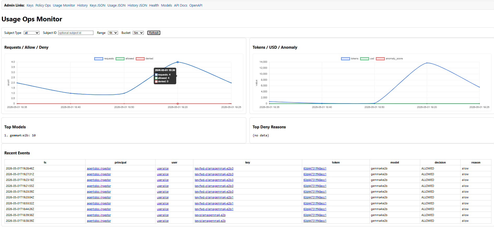

# Usage reviewer agent: named projections, triggers, and gateway-backed LangChain/Ollama

This walkthrough comes after [`keycloak_admin_first_setup.md`](keycloak_admin_first_setup.md).
The core reusable module lives in [`modelkeyguard.reviewer_agent`](../modelkeyguard/reviewer_agent.py).
It assumes you already created:

- `user:alice`
- `agent:doc-ingestor`
- `agent:usage-reviewer`
- a provider key for the Ollama-shaped route
- the safe token issued for `agent:doc-ingestor`

If you just finished the previous tutorial, the handoff section is:
[`keycloak_admin_first_setup.md#next-run-the-reviewer-agent`](keycloak_admin_first_setup.md#next-run-the-reviewer-agent).

If you want a faster local-only ramp before this full walkthrough, start from:
[`governance_quickstart_deterministic_jsonl.md`](governance_quickstart_deterministic_jsonl.md),
then continue to:
[`governance_quickstart_llm_migration.md`](governance_quickstart_llm_migration.md).

The reviewer is split into two parts:

1. a query path that reads rebuildable named projections and history state
2. an execution path that uses LangChain/Ollama through the gateway with the safe token you created earlier

The reviewer is designed to run from a separate machine just like a normal
human or service account would:

- `MODELKEYGUARD_GATEWAY_PUBLIC_URL` points at the gateway
- `KEYCLOAK_URL` points at Keycloak
- `MODELKEYGUARD_OIDC_USAGE_CLIENT_ID` / `MODELKEYGUARD_OIDC_USAGE_CLIENT_SECRET`
  mint the reviewer’s OAuth service-account token
- `REVIEWER_SAFE_TOKEN` authorizes the reviewer’s Ollama-shaped model call
- `SAFE_TOKEN` from the first tutorial still belongs to the doc-ingestor demo

This walkthrough assumes you already minted `REVIEWER_SAFE_TOKEN` in
[`keycloak_admin_first_setup.md`](keycloak_admin_first_setup.md).

Handoff sanity check from the previous tutorial:

```bash
test -n "${REVIEWER_SAFE_TOKEN:-}" || echo "missing REVIEWER_SAFE_TOKEN"
./scripts/get_agent_token.sh modelguard-usage-agent usage-agent-secret >/dev/null && echo "usage-agent token mint ok"
```

Note on token lifetime:
the bundled Keycloak realm imports set `accessTokenLifespan` to `300` seconds
(about 5 minutes). If you see `401 Unauthorized` during a longer session, mint
`REVIEWER_TOKEN` again and re-export `MODELKEYGUARD_BEARER_TOKEN`.

For the read-only review status query, the reviewer identity must have the
`model.usage.read` role, or the equivalent read claim in your OAuth provider.
In the bundled Keycloak flow, grant that role to the
`modelguard-usage-agent` service account. If you use a different OAuth system,
give the reviewer client/token the matching read permission there too. If you
want to advance the checkpoint projection, keep that as an admin-authenticated
write path.

In Keycloak GUI:

Admin Console link:
`${KEYCLOAK_URL:-http://127.0.0.1:8080}/admin/` (realm: `modelguard`)

1. Open `modelguard-usage-agent`
2. Go to `Service account roles`
3. Add the `model.usage.read` realm role

If you manage OAuth roles by CLI or API, assign the same read role there. The
review-status query must see the role before it will return data.

## 1. Inspect the review checkpoint

The review checkpoint is a named projection. It is rebuildable and not an
authoritative table.

First mint the reviewer service-account token that can read review status:

```bash
export REVIEWER_TOKEN="$(./scripts/get_agent_token.sh modelguard-usage-agent usage-agent-secret)"
```

Quick refresh (safe to re-run any time):

```bash
export REVIEWER_TOKEN="$(./scripts/get_agent_token.sh modelguard-usage-agent usage-agent-secret)"
export MODELKEYGUARD_BEARER_TOKEN="$REVIEWER_TOKEN"
```

Query it from the gateway:

```bash
modelkeyguard review-status \
  --base-url "${MODELKEYGUARD_GATEWAY_PUBLIC_URL:-http://127.0.0.1:8789}" \
  --bearer-token "${REVIEWER_TOKEN}"
```

Or use REST directly:

```bash
curl -sS \
  -H "Authorization: Bearer ${REVIEWER_TOKEN}" \
  "${MODELKEYGUARD_GATEWAY_PUBLIC_URL:-http://127.0.0.1:8789}/admin/review/status.json" \
  | python -m json.tool
```

If your gateway is configured for the shared admin secret instead of a bearer
token, swap the header for:

```bash
-H "x-modelkeyguard-admin-secret: ${MODELKEYGUARD_ADMIN_API_SECRET}"
```

The status payload shows the current checkpoint and the trigger counters since
that checkpoint:

- token used since last review
- dollar used since last review
- conversation count since last review
- dangerous keyword hits since last review

Those counters come from append-only graph/history data and from the review
checkpoint projection.

## 2. Run the reviewer through the gateway

The runner uses the gateway’s Ollama-shaped route and the reviewer token
minted in the first tutorial. The system prompt stays aligned with the
reviewer policy, while the user message carries the review summary.

Use a strict one-shot env block so the run always uses the fresh
`REVIEWER_TOKEN` for review-status auth and ignores other auth env vars from
the current shell:

```bash
env -u MODELKEYGUARD_ADMIN_API_SECRET \
    -u MODELKEYGUARD_OIDC_USAGE_CLIENT_SECRET \
    MODELKEYGUARD_BEARER_TOKEN="$REVIEWER_TOKEN" \
    MODELKEYGUARD_KEY_ID="${MODELKEYGUARD_KEY_ID:-key:fwd-ollama:gemma4-e2b:3}" \
    KGW_BASE_URL="${MODELKEYGUARD_GATEWAY_PUBLIC_URL:-http://127.0.0.1:8789}" \
    REVIEWER_SAFE_TOKEN="${REVIEWER_SAFE_TOKEN}" \
    KGW_OLLAMA_MODEL="${KGW_OLLAMA_MODEL:-gemma4:e2b}" \
    python scripts/usage_reviewer_agent.py
```
<div style="max-height: 300px; overflow-y: auto;">

```json
$ env -u MODELKEYGUARD_ADMIN_API_SECRET     -u MODELKEYGUARD_OIDC_USAGE_CLIENT_SECRET     MODELKEYGUARD_BEARER_TOKEN="$REVIEWER_TOKEN"     KGW_BASE_URL="${MODELKEYGUARD_GATEWAY_PUBLIC_URL:-http://127.0.0.1:8789}"     REVIEWER_SAFE_TOKEN="${REVIEWER_SAFE_TOKEN}"     KGW_OLLAMA_MODEL="${KGW_OLLAMA_MODEL:-gemma4:e2b}"     python scripts/usage_reviewer_agent.py
review_status:
{
  "checkpoint": {
    "last_reviewed_request_id": "",
    "last_reviewed_ts": "1970-01-01T00:00:00Z",
    "projection_schema_version": 1,
    "reviewed_at": "",
    "reviewed_by": ""
  },
  "dangerous_keyword_hits": [
    {
      "count": 25,
      "keyword": "secret",
      "request_ids": [
        "02bffeb87d5ee85e0fa26d45",
        "req-1777660164343",
        "7c2b5c81466594a17627e866",
        "0fe4b5f1e47e6bdcfe68e3c1",
        "9ebc23b997274ae6e29e248f",
        "50b57c81fab2f151b5727ad7",
        "0002db67738d85c6c53fa090",
        "req-1777661103210",
        "req-1777661118812",
        "req-1777661179811"
      ]
    },
    {
      "count": 15,
      "keyword": "token",
      "request_ids": [
        "02bffeb87d5ee85e0fa26d45",
        "req-1777660164343",
        "50b57c81fab2f151b5727ad7",
        "0002db67738d85c6c53fa090",
        "auth-1777661398734295302",
        "a5a9f9582879f7ca5fd42a07",
        "auth-1777663091132007566",
        "auth-1777663128206688581",
        "auth-1777663143252576807",
        "0184b26cd5422c70e86f2a08"
      ]
    },
    {
      "count": 7,
      "keyword": "password",
      "request_ids": [
        "auth-1777661398734295302",
        "0184b26cd5422c70e86f2a08",
        "69da15b32184df59f4c3748a",
        "9709f2ffe067da46333c89fd",
        "fd79f128df2934a14701a414",
        "req-1777796317717",
        "req-1777796521610"
      ]
    },
    {
      "count": 7,
      "keyword": "credential",
      "request_ids": [
        "auth-1777661398734295302",
        "0184b26cd5422c70e86f2a08",
        "69da15b32184df59f4c3748a",
        "9709f2ffe067da46333c89fd",
        "fd79f128df2934a14701a414",
        "req-1777796317717",
        "req-1777796521610"
      ]
    },
    {
      "count": 10,
      "keyword": "bearer",
      "request_ids": [
        "auth-1777661398734295302",
        "auth-1777663091132007566",
        "auth-1777663128206688581",
        "auth-1777663143252576807",
        "0184b26cd5422c70e86f2a08",
        "69da15b32184df59f4c3748a",
        "9709f2ffe067da46333c89fd",
        "fd79f128df2934a14701a414",
        "req-1777796317717",
        "req-1777796521610"
      ]
    },
    {
      "count": 7,
      "keyword": "api key",
      "request_ids": [
        "auth-1777661398734295302",
        "0184b26cd5422c70e86f2a08",
        "69da15b32184df59f4c3748a",
        "9709f2ffe067da46333c89fd",
        "fd79f128df2934a14701a414",
        "req-1777796317717",
        "req-1777796521610"
      ]
    },
    {
      "count": 7,
      "keyword": "apikey",
      "request_ids": [
        "auth-1777661398734295302",
        "0184b26cd5422c70e86f2a08",
        "69da15b32184df59f4c3748a",
        "9709f2ffe067da46333c89fd",
        "fd79f128df2934a14701a414",
        "req-1777796317717",
        "req-1777796521610"
      ]
    },
    {
      "count": 7,
      "keyword": "private key",
      "request_ids": [
        "auth-1777661398734295302",
        "0184b26cd5422c70e86f2a08",
        "69da15b32184df59f4c3748a",
        "9709f2ffe067da46333c89fd",
        "fd79f128df2934a14701a414",
        "req-1777796317717",
        "req-1777796521610"
      ]
    },
    {
      "count": 25,
      "keyword": "exfiltrate",
      "request_ids": [
        "02bffeb87d5ee85e0fa26d45",
        "req-1777660164343",
        "7c2b5c81466594a17627e866",
        "0fe4b5f1e47e6bdcfe68e3c1",
        "9ebc23b997274ae6e29e248f",
        "50b57c81fab2f151b5727ad7",
        "0002db67738d85c6c53fa090",
        "req-1777661103210",
        "req-1777661118812",
        "req-1777661179811"
      ]
    },
    {
      "count": 7,
      "keyword": "dump",
      "request_ids": [
        "auth-1777661398734295302",
        "0184b26cd5422c70e86f2a08",
        "69da15b32184df59f4c3748a",
        "9709f2ffe067da46333c89fd",
        "fd79f128df2934a14701a414",
        "req-1777796317717",
        "req-1777796521610"
      ]
    },
    {
      "count": 7,
      "keyword": "reveal",
      "request_ids": [
        "auth-1777661398734295302",
        "0184b26cd5422c70e86f2a08",
        "69da15b32184df59f4c3748a",
        "9709f2ffe067da46333c89fd",
        "fd79f128df2934a14701a414",
        "req-1777796317717",
        "req-1777796521610"
      ]
    },
    {
      "count": 7,
      "keyword": "leak",
      "request_ids": [
        "auth-1777661398734295302",
        "0184b26cd5422c70e86f2a08",
        "69da15b32184df59f4c3748a",
        "9709f2ffe067da46333c89fd",
        "fd79f128df2934a14701a414",
        "req-1777796317717",
        "req-1777796521610"
      ]
    },
    {
      "count": 7,
      "keyword": "print",
      "request_ids": [
        "auth-1777661398734295302",
        "0184b26cd5422c70e86f2a08",
        "69da15b32184df59f4c3748a",
        "9709f2ffe067da46333c89fd",
        "fd79f128df2934a14701a414",
        "req-1777796317717",
        "req-1777796521610"
      ]
    }
  ],
  "generated_at": "2026-05-03T08:22:25.669138+00:00",
  "history_preview": [
    {
      "matched_keywords": [
        "bearer",
        "token"
      ],
      "request_id": "auth-1777663128206688581",
      "ts": "2026-05-01T19:18:48Z"
    },
    {
      "matched_keywords": [
        "bearer",
        "token"
      ],
      "request_id": "auth-1777663143252576807",
      "ts": "2026-05-01T19:19:03Z"
    },
    {
      "matched_keywords": [],
      "request_id": "8808eb6289632d7d913e9319",
      "ts": "2026-05-01T19:20:04Z"
    },
    {
      "matched_keywords": [
        "api key",
        "apikey",
        "bearer",
        "credential",
        "dump",
        "leak",
        "password",
        "print",
        "private key",
        "reveal",
        "token"
      ],
      "request_id": "0184b26cd5422c70e86f2a08",
      "ts": "2026-05-01T19:20:39Z"
    },
    {
      "matched_keywords": [
        "api key",
        "apikey",
        "bearer",
        "credential",
        "dump",
        "leak",
        "password",
        "print",
        "private key",
        "reveal"
      ],
      "request_id": "69da15b32184df59f4c3748a",
      "ts": "2026-05-01T19:21:55Z"
    },
    {
      "matched_keywords": [
        "api key",
        "apikey",
        "bearer",
        "credential",
        "dump",
        "leak",
        "password",
        "print",
        "private key",
        "reveal"
      ],
      "request_id": "9709f2ffe067da46333c89fd",
      "ts": "2026-05-01T19:23:18Z"
    },
    {
      "matched_keywords": [
        "api key",
        "apikey",
        "bearer",
        "credential",
        "dump",
        "leak",
        "password",
        "print",
        "private key",
        "reveal"
      ],
      "request_id": "fd79f128df2934a14701a414",
      "ts": "2026-05-01T19:27:31Z"
    },
    {
      "matched_keywords": [],
      "request_id": "feef9e25ee2af5431386294b",
      "ts": "2026-05-01T19:28:46Z"
    },
    {
      "matched_keywords": [
        "api key",
        "apikey",
        "bearer",
        "credential",
        "dump",
        "leak",
        "password",
        "print",
        "private key",
        "reveal"
      ],
      "request_id": "req-1777796317717",
      "ts": "2026-05-03T08:18:37Z"
    },
    {
      "matched_keywords": [
        "api key",
        "apikey",
        "bearer",
        "credential",
        "dump",
        "leak",
        "password",
        "print",
        "private key",
        "reveal"
      ],
      "request_id": "req-1777796521610",
      "ts": "2026-05-03T08:22:01Z"
    }
  ],
  "review_rules": {
    "conversation_count_since_last_review": {
      "threshold": 10
    },
    "dangerous_keywords": {
      "keywords": [
        "secret",
        "token",
        "password",
        "credential",
        "bearer",
        "api key",
        "apikey",
        "private key",
        "exfiltrate",
        "dump",
        "reveal",
        "leak",
        "print"
      ],
      "threshold": 1
    },
    "dollar_used_since_last_review": {
      "threshold": 1.0
    },
    "token_used_since_last_review": {
      "threshold": 50000
    }
  },
  "reviewer": "modelkeyguard.reviewer_agent",
  "should_review": true,
  "summary": {
    "conversation_count_since_last_review": 25,
    "dangerous_keyword_hits": 138,
    "dollar_used_since_last_review": 0.042948,
    "token_used_since_last_review": 21474
  },
  "triggers": [
    {
      "current": 21474,
      "threshold": 50000.0,
      "trigger_id": "token_used_since_last_review",
      "triggered": false,
      "unit": "tokens"
    },
    {
      "current": 0.042948,
      "threshold": 1.0,
      "trigger_id": "dollar_used_since_last_review",
      "triggered": false,
      "unit": "usd"
    },
    {
      "current": 25,
      "threshold": 10.0,
      "trigger_id": "conversation_count_since_last_review",
      "triggered": true,
      "unit": "conversations"
    },
    {
      "current": 138,
      "hits": [
        {
          "count": 25,
          "keyword": "secret",
          "request_ids": [
            "02bffeb87d5ee85e0fa26d45",
            "req-1777660164343",
            "7c2b5c81466594a17627e866",
            "0fe4b5f1e47e6bdcfe68e3c1",
            "9ebc23b997274ae6e29e248f",
            "50b57c81fab2f151b5727ad7",
            "0002db67738d85c6c53fa090",
            "req-1777661103210",
            "req-1777661118812",
            "req-1777661179811"
          ]
        },
        {
          "count": 15,
          "keyword": "token",
          "request_ids": [
            "02bffeb87d5ee85e0fa26d45",
            "req-1777660164343",
            "50b57c81fab2f151b5727ad7",
            "0002db67738d85c6c53fa090",
            "auth-1777661398734295302",
            "a5a9f9582879f7ca5fd42a07",
            "auth-1777663091132007566",
            "auth-1777663128206688581",
            "auth-1777663143252576807",
            "0184b26cd5422c70e86f2a08"
          ]
        },
        {
          "count": 7,
          "keyword": "password",
          "request_ids": [
            "auth-1777661398734295302",
            "0184b26cd5422c70e86f2a08",
            "69da15b32184df59f4c3748a",
            "9709f2ffe067da46333c89fd",
            "fd79f128df2934a14701a414",
            "req-1777796317717",
            "req-1777796521610"
          ]
        },
        {
          "count": 7,
          "keyword": "credential",
          "request_ids": [
            "auth-1777661398734295302",
            "0184b26cd5422c70e86f2a08",
            "69da15b32184df59f4c3748a",
            "9709f2ffe067da46333c89fd",
            "fd79f128df2934a14701a414",
            "req-1777796317717",
            "req-1777796521610"
          ]
        },
        {
          "count": 10,
          "keyword": "bearer",
          "request_ids": [
            "auth-1777661398734295302",
            "auth-1777663091132007566",
            "auth-1777663128206688581",
            "auth-1777663143252576807",
            "0184b26cd5422c70e86f2a08",
            "69da15b32184df59f4c3748a",
            "9709f2ffe067da46333c89fd",
            "fd79f128df2934a14701a414",
            "req-1777796317717",
            "req-1777796521610"
          ]
        },
        {
          "count": 7,
          "keyword": "api key",
          "request_ids": [
            "auth-1777661398734295302",
            "0184b26cd5422c70e86f2a08",
            "69da15b32184df59f4c3748a",
            "9709f2ffe067da46333c89fd",
            "fd79f128df2934a14701a414",
            "req-1777796317717",
            "req-1777796521610"
          ]
        },
        {
          "count": 7,
          "keyword": "apikey",
          "request_ids": [
            "auth-1777661398734295302",
            "0184b26cd5422c70e86f2a08",
            "69da15b32184df59f4c3748a",
            "9709f2ffe067da46333c89fd",
            "fd79f128df2934a14701a414",
            "req-1777796317717",
            "req-1777796521610"
          ]
        },
        {
          "count": 7,
          "keyword": "private key",
          "request_ids": [
            "auth-1777661398734295302",
            "0184b26cd5422c70e86f2a08",
            "69da15b32184df59f4c3748a",
            "9709f2ffe067da46333c89fd",
            "fd79f128df2934a14701a414",
            "req-1777796317717",
            "req-1777796521610"
          ]
        },
        {
          "count": 25,
          "keyword": "exfiltrate",
          "request_ids": [
            "02bffeb87d5ee85e0fa26d45",
            "req-1777660164343",
            "7c2b5c81466594a17627e866",
            "0fe4b5f1e47e6bdcfe68e3c1",
            "9ebc23b997274ae6e29e248f",
            "50b57c81fab2f151b5727ad7",
            "0002db67738d85c6c53fa090",
            "req-1777661103210",
            "req-1777661118812",
            "req-1777661179811"
          ]
        },
        {
          "count": 7,
          "keyword": "dump",
          "request_ids": [
            "auth-1777661398734295302",
            "0184b26cd5422c70e86f2a08",
            "69da15b32184df59f4c3748a",
            "9709f2ffe067da46333c89fd",
            "fd79f128df2934a14701a414",
            "req-1777796317717",
            "req-1777796521610"
          ]
        },
        {
          "count": 7,
          "keyword": "reveal",
          "request_ids": [
            "auth-1777661398734295302",
            "0184b26cd5422c70e86f2a08",
            "69da15b32184df59f4c3748a",
            "9709f2ffe067da46333c89fd",
            "fd79f128df2934a14701a414",
            "req-1777796317717",
            "req-1777796521610"
          ]
        },
        {
          "count": 7,
          "keyword": "leak",
          "request_ids": [
            "auth-1777661398734295302",
            "0184b26cd5422c70e86f2a08",
            "69da15b32184df59f4c3748a",
            "9709f2ffe067da46333c89fd",
            "fd79f128df2934a14701a414",
            "req-1777796317717",
            "req-1777796521610"
          ]
        },
        {
          "count": 7,
          "keyword": "print",
          "request_ids": [
            "auth-1777661398734295302",
            "0184b26cd5422c70e86f2a08",
            "69da15b32184df59f4c3748a",
            "9709f2ffe067da46333c89fd",
            "fd79f128df2934a14701a414",
            "req-1777796317717",
            "req-1777796521610"
          ]
        }
      ],
      "keywords": [
        "secret",
        "token",
        "password",
        "credential",
        "bearer",
        "api key",
        "apikey",
        "private key",
        "exfiltrate",
        "dump",
        "reveal",
        "leak",
        "print"
      ],
      "threshold": 1,
      "trigger_id": "dangerous_keyword_hits",
      "triggered": true,
      "unit": "hits"
    }
  ],
  "usage_preview": [
    {
      "actual_cost_usd": 0.001136,
      "actual_tokens": 568,
      "estimated_cost_usd": 0.001136,
      "on_behalf_of_user_id": "user:alice",
      "principal_id": "agent:doc-ingestor",
      "request_id": "9ebc23b997274ae6e29e248f",
      "token_id": "60d44731ff48ecc1",
      "ts": "2026-05-01T18:38:40.024692+00:00"
    },
    {
      "actual_cost_usd": 0.00024,
      "actual_tokens": 120,
      "estimated_cost_usd": 0.00024,
      "on_behalf_of_user_id": "user:alice",
      "principal_id": "agent:doc-ingestor",
      "request_id": "50b57c81fab2f151b5727ad7",
      "token_id": "60d44731ff48ecc1",
      "ts": "2026-05-01T18:39:38.239796+00:00"
    },
    {
      "actual_cost_usd": 0.00024,
      "actual_tokens": 120,
      "estimated_cost_usd": 0.00024,
      "on_behalf_of_user_id": "user:alice",
      "principal_id": "agent:doc-ingestor",
      "request_id": "0002db67738d85c6c53fa090",
      "token_id": "60d44731ff48ecc1",
      "ts": "2026-05-01T18:44:42.494161+00:00"
    },
    {
      "actual_cost_usd": 0.00024,
      "actual_tokens": 120,
      "estimated_cost_usd": 0.00024,
      "on_behalf_of_user_id": "user:alice",
      "principal_id": "agent:doc-ingestor",
      "request_id": "a5a9f9582879f7ca5fd42a07",
      "token_id": "60d44731ff48ecc1",
      "ts": "2026-05-01T18:50:46.650879+00:00"
    },
    {
      "actual_cost_usd": 0.001136,
      "actual_tokens": 568,
      "estimated_cost_usd": 0.001136,
      "on_behalf_of_user_id": "user:alice",
      "principal_id": "agent:doc-ingestor",
      "request_id": "8808eb6289632d7d913e9319",
      "token_id": "60d44731ff48ecc1",
      "ts": "2026-05-01T19:20:20.688228+00:00"
    },
    {
      "actual_cost_usd": 0.00805,
      "actual_tokens": 4025,
      "estimated_cost_usd": 0.00805,
      "on_behalf_of_user_id": "user:alice",
      "principal_id": "agent:doc-ingestor",
      "request_id": "0184b26cd5422c70e86f2a08",
      "token_id": "60d44731ff48ecc1",
      "ts": "2026-05-01T19:20:46.484356+00:00"
    },
    {
      "actual_cost_usd": 0.008786,
      "actual_tokens": 4393,
      "estimated_cost_usd": 0.008786,
      "on_behalf_of_user_id": "user:alice",
      "principal_id": "agent:doc-ingestor",
      "request_id": "69da15b32184df59f4c3748a",
      "token_id": "60d44731ff48ecc1",
      "ts": "2026-05-01T19:22:05.149152+00:00"
    },
    {
      "actual_cost_usd": 0.009472,
      "actual_tokens": 4736,
      "estimated_cost_usd": 0.009472,
      "on_behalf_of_user_id": "user:alice",
      "principal_id": "agent:doc-ingestor",
      "request_id": "9709f2ffe067da46333c89fd",
      "token_id": "60d44731ff48ecc1",
      "ts": "2026-05-01T19:23:27.624234+00:00"
    },
    {
      "actual_cost_usd": 0.01,
      "actual_tokens": 5000,
      "estimated_cost_usd": 0.01,
      "on_behalf_of_user_id": "user:alice",
      "principal_id": "agent:doc-ingestor",
      "request_id": "fd79f128df2934a14701a414",
      "token_id": "60d44731ff48ecc1",
      "ts": "2026-05-01T19:27:35.333792+00:00"
    },
    {
      "actual_cost_usd": 0.001136,
      "actual_tokens": 568,
      "estimated_cost_usd": 0.001136,
      "on_behalf_of_user_id": "user:alice",
      "principal_id": "agent:doc-ingestor",
      "request_id": "feef9e25ee2af5431386294b",
      "token_id": "60d44731ff48ecc1",
      "ts": "2026-05-01T19:28:50.737642+00:00"
    }
  ],
  "window": {
    "history_records": 25,
    "latest_request_id": "req-1777796521610",
    "latest_ts": "2026-05-03T08:22:01Z",
    "usage_records": 13
  }
}
review_result:
{
  "base_url": "http://127.0.0.1:8789",
  "key_id": "key:fwd-ollama:gemma4-e2b:3",
  "model": "gemma4:e2b",
  "text": "The provided data indicates that the user has engaged in activities that triggered safety or policy checks. Specifically, the conversation history contains numerous references to potentially sensitive or prohibited content, as evidenced by the high frequency of mentions related to data extraction and pattern recognition, which is flagged by the safety system.\n\n**Summary of Findings:**\n\n1.  **High Activity Level:** The interaction involved multiple requests that seem aimed at extracting or processing information, which is a pattern often associated with policy violations.\n2.  **Policy Violation Risk:** The content likely touches upon areas that are restricted, making the pattern recognition a concern for safety systems.\n\n**Conclusion:**\n\nThe request pattern strongly suggests a potential violation of usage policies. Further review is necessary to ensure compliance with all safety guidelines."
}
reviewer_loop_health:
{
  "breaker_tripped": false,
  "consecutive_failures": 0,
  "last_error_family": "",
  "last_error_message": "",
  "last_heartbeat_ts": "2026-05-03T08:22:41.987404Z",
  "last_success_ts": "2026-05-03T08:22:41.987380Z",
  "next_retry_at": "",
  "projection_schema_version": 1,
  "state": "run",
  "workflow_name": "usage_reviewer"
}

```
</div>

Note that you may see an llm interpreted result from the sample one
```bash
(...)
review_result:
{
  "base_url": "http://127.0.0.1:8789",
  "key_id": "key:fwd-ollama:gemma4-e2b:3",
  "model": "gemma4:e2b",
  "text": "The provided data indicates that the user has engaged in activities that triggered safety or policy checks. Specifically, the conversation history contains numerous references to potentially sensitive or prohibited content, as evidenced by the high frequency of mentions related to data extraction and pattern recognition, which is flagged by the safety system.\n\n**Summary of Findings:**\n\n1.  **High Activity Level:** The interaction involved multiple requests that seem aimed at extracting or processing information, which is a pattern often associated with policy violations.\n2.  **Policy Violation Risk:** The content likely touches upon areas that are restricted, making the pattern recognition a concern for safety systems.\n\n**Conclusion:**\n\nThe request pattern strongly suggests a potential violation of usage policies. Further review is necessary to ensure compliance with all safety guidelines."
}
(...)
```

If you see `model_key_ambiguous` from the reviewer model call, it means more
than one key can route that model. Set `MODELKEYGUARD_KEY_ID` explicitly.

The script prints:

- the current review status
- whether any trigger threshold fired
- the LangChain/Ollama reviewer note

If you want to force a review note even when the thresholds have not fired yet,
pass `--force`.

For loop-mode hardening (backoff/breaker/state semantics), see
[`docs_governance_runtime.md`](../docs_governance_runtime.md). The reviewer
script supports:

- `--loop`
- `--interval-seconds`
- `--max-iterations`
- `--scanner-backoff-initial-seconds`
- `--scanner-backoff-max-seconds`
- `--scanner-breaker-enabled`
- `--scanner-breaker-max-failures`
- `--scanner-error-family-policy-json`

<p align="center">
  
</p>
<p align="center"><em>Usage monitor page (`/admin/usage`) used by operators alongside reviewer triggers.</em></p>

## 3. Acknowledge the checkpoint

The checkpoint projection advances when the review has been acknowledged. That
write path is separate from the query path.

If you have admin auth available, you can advance the checkpoint with the
gateway API:

```bash
curl -fsS -X POST \
  "${MODELKEYGUARD_GATEWAY_PUBLIC_URL:-http://127.0.0.1:8789}/admin/review/checkpoint" \
  -H "Authorization: Bearer ${ADMIN_TOKEN}" \
  -H "content-type: application/json" \
  -d '{"reviewed_by":"usage_reviewer_agent","review_summary":"checkpoint advanced","status":{}}' \
  | python -m json.tool
```

If you prefer the shared admin secret, use the same endpoint with:

```bash
-H "x-modelkeyguard-admin-secret: ${MODELKEYGUARD_ADMIN_API_SECRET}"
```

The important bit is not the exact transport. It is that the review checkpoint
is stored as a rebuildable named projection, not as a hidden authoritative
record.

## 4. When the reviewer should run

The default policy now contains review triggers for:

- token usage since the last review
- dollar usage since the last review
- conversation count since the last review
- dangerous keyword hits

Those triggers are policy-driven. If you want to tune them, edit
`config/gateway_policy.json` and then re-run the status query.

## 5. Where to look next

The reviewer status and checkpoint data are queryable through both CLI and REST.
The operational review output is a separate path and should not be treated as
the source of truth. The append-only graph and rebuildable named projections are
the source of truth.
